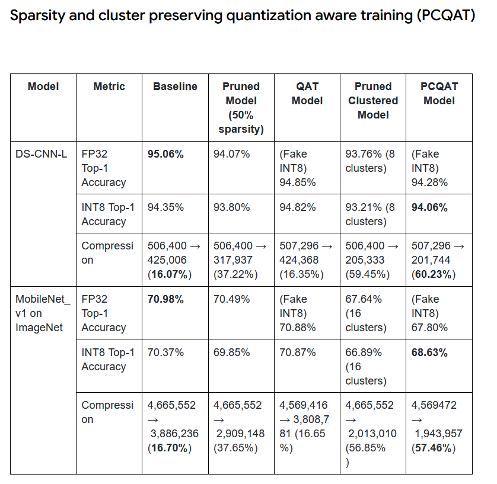

# MushroomML: TinyML Image Classification for ESP32

**[Midterm Report Video](https://youtu.be/SYshEc5l9hQ)**

**[Final Report Video](https://youtu.be/i-ZzFhrRzN8)**

## 1. Project Overview
MushroomML is a lightweight end-to-end image classification system designed to identify 9 distinct mushroom genera in real-time. The project leverages **Collaborative Optimization (Pruning + Clustering + Quantization)** to shrink a Convolutional Neural Network (CNN) small enough to run on the **Seeed Studio XIAO ESP32-S3**.

The system is designed to help foragers identify mushrooms or reject unknown samples with a low-latency, offline inference engine.

## 2. Goals
1.  **Model Accuracy:** Achieve reliable classification on 9 fungal genera.
2.  **TinyML Optimization:** Utilize Pruning, Clustering, and Quantization Aware Training (PCQAT) to compress the model.
3.  **Hardware Deployment:** Deploy an INT8 TFLite model to the ESP32-S3 (Sense) with camera support.

## 3. Environment & Installation

### Supported Environment
* **OS:** Windows / Linux / MacOS
* **Python:** 3.10+
* **Hardware:** NVIDIA GPU recommended for training (CUDA support), though CPU is sufficient for inference testing.

### Installation
1.  **Clone the repository:**
    ```bash
    git clone https://github.com/Gabinson200/MushroomML/tree/final
    cd MushroomML/mobile_netv2_50
    ```

2.  **Install Dependencies:**
    ```bash
    pip install -r requirements.txt
    ```

3.  **Download Dataset:**
    Download the dataset from [Kaggle](https://www.kaggle.com/datasets/maysee/mushrooms-classification-common-genuss-images) and extract it into a folder named `data/Mushrooms`.

## 4. Usage

To replicate the results, you can use the provided Makefile:

**Run the Jupyter Notebook (Training & Visualization):**
```bash
jupyter notebook mymushroom.ipynb
```

**Run the Automated Tests:**
```bash
make test
```

## 5. Data Pipeline
### Collection & Cleaning

Source: Kaggle Common Genus Images.
Classes (9): Agaricus, Amanita, Boletus, Cortinarius, Entoloma, Hygrocybe, Lactarius, Russula, Suillus.
Imbalance Handling: The dataset was highly imbalanced (e.g., Lactarius ~1500 images vs Hygrocybe ~300). We implemented a Balanced Data Sampler using tf.data.Dataset.sample_from_datasets to ensure the model sees an equal probability of classes during training.

### Preprocessing & Augmentation

Resize: 240x240 pixels.
Normalization: Pixel values scaled to [-1, 1].
Augmentation Layers: RandomRotation, RandomFlip, RandomZoom, RandomContrast, and RandomBrightness were applied dynamically during training to prevent overfitting.

## 6. Modeling Strategy
We utilized a Transfer Learning approach with MobileNetV2 (Alpha 0.5) as the backbone. The training pipeline followed a strict optimization path for embedded deployment:

Baseline Training: Fine-tuned MobileNetV2 on the balanced dataset.

Pruning: Applied tfmot.sparsity to remove 30-50% of unnecessary weights.

Clustering: Applied tfmot.clustering (16-32 clusters) to group weight values, enhancing compressibility.

PCQAT (Pruning Clustered Quantization Aware Training): Fine-tuned the model while simulating INT8 quantization effects to preserve accuracy during conversion.

TFLite Conversion: Converted to full integer quantization (INT8) using a representative dataset.

## 7. Results & Visualizations
Performance Metrics

Baseline Validation Accuracy: ~66.8%

Final TFLite (INT8) Test Accuracy: ~69.1%

Model Size: < 1MB (Fits easily in ESP32-S3 Flash)

While the accuracy metrics are not great they are very much inline with expected accuracies of PCQAT models per tensorflow documentation of similar models:



Confusion Matrix:


## 8. Testing

We utilize pytest for unit testing the data pipeline and model architecture.

To run tests locally:
```bash
pytest tests/
```

### GitHub Actions Workflow

A CI/CD pipeline is defined in .github/workflows/main.yml. It automatically:

1. Sets up a Python environment.
2. Installs dependencies.
3. Runs the test suite to ensure the data loader functions and model output shapes are correct.
